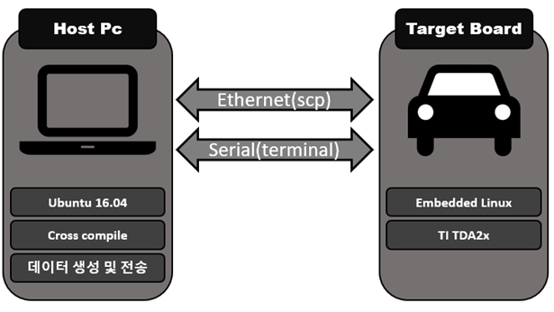
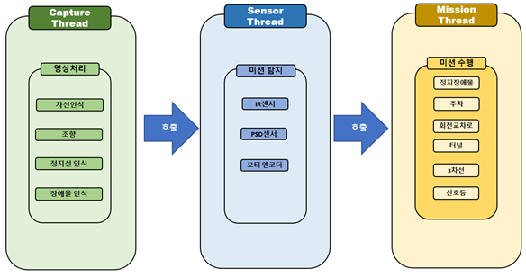
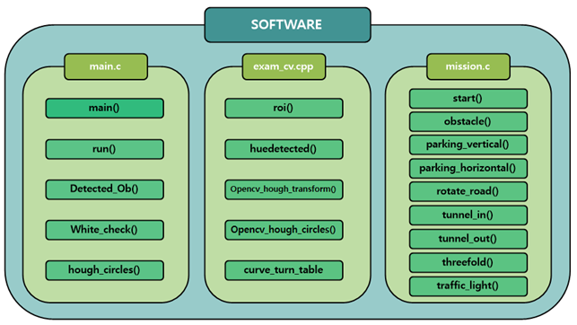
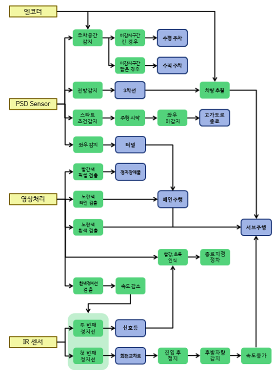

# 2020ESW_AutonomousCarContest

[단국대학교 MAZE](https://maze.co.kr) 영차영차 팀 개발내용

개발 기간 : 2020.07 ~ 2020.12 

대회 홈페이지 : [임베디드 SW 경진대회](https://eswcontest.or.kr/main/main.php)

주관 : [임베디드 소프트웨어 시스템 산업협회](https://kessia.kr/main/main.php)

주최 : 산업통상자원부

후원 : 한국전자기술연구원(KETI),한국전자통신연구원(ETRI), 현대모비스, LG 전자 등

[개발완료 보고서 PDF](./PDF/2020ESWContest_자율주행모형자동차_2051_영차영차_개발완료보고서.pdf)

대회 결과 : 특선상(현대모비스) [PDF](./PDF/2020_임베디드소프트웨어공모전_특선상.pdf)

## 팀원 구성

|팀원|맡은 역할|
|:---------:|:---:|
|김진성 (팀장)| 소프트웨어 구조 설계, 정지 장애물 알고리즘 구현 |
|김종욱| 차선 인식 및 주행 알고리즘 구현, 회전 교차로 알고리즘 구현  |
|박상재| 주차 및 주행 알고리즘 구현 |
|[이진호](https://github.com/StylishPanther)|전체 미션 알고리즘 통합 및 개발환경 구축 | 
|[고승일](https://github.com/gseung)|주행 알고리즘 및 개발환경 구축|   

## 동작 영상  

- [전체 미션 수행 동영상](https://www.youtube.com/watch?v=f_BQ3XMBDCw)

 

 < 고가 도로 주행 테스트 >
  

  

 < Lane Keeping 알고리즘 테스트 >
  

  

 < 회전 교차로 주행 테스트 >

  

 < 수평, 수직 주차 테스트 >

 

 

 < 터널 통과 테스트 >
  

 

 < 3차선 도로 장애물 통과 테스트 >
  

 

 < 신호등 통과 테스트 >
  

## 작품 설명  

### 하드웨어 품목  

|Hardware Type|Description|  
|:---:|:---:|
|모형자동차|현대모비스 제공||  

### Development Environment

- 노트북에 Ubuntu 16.04를 설치하여 Linux 환경을 제공하는 Host Pc로 활용하였고, 터미널 편집기를 통하여 소스코드를 작성하였다. 모형자동차(Target Board)는 Embedded Linux 기반의 OS(Operating System)를 사용하며, Serial 통신 및 Ethernet을 통해 Host Pc와 상호작용한다.

- Serial 통신을 통해 Target Board의 터미널을 확인함으로써 센서값 ,영상 픽셀값 등을 출력하여 디버깅에 활용하였으며 Ethernet을 통해 Host Pc에서 작성한 실행파일의 데이터를 Target board에 전송하였다. 

- 기본적으로 C언어를 통해 소스코드를 작성하였으며, 차선인식 및 신호등과 같이 영상처리가 필요한 부분은 C++언어를 활용하였다. 이때 주어진 OpenCV 라이브러리의 함수를 적극적으로 활용하여 작성하였다.

 

 < Software Architecture >
  
 

### Program Flow Chart

- 쓰레드간의 메모리충돌을 막기 위해 mutex 잠금을 통해 동기화하였으며, 조건변수를 활용하여 쓰레드 간의 호출에 이용하였다. 이때 각 쓰레드는 잠금 되었다가 호출에 따라 활성화와 비활성화를 반복한다. 전체 쓰레드 구조는 capture_thread, sensor_thread 그리고 각 미션 쓰레드들로 구성된다. 

 

 < Thread Architecture >
  

- capture_thread는 영상처리 및 주 쓰레드로써 일정 주기마다 sensor_thread를 호출한다. 호출에 따라 sensor_thread가 라인 감지용 IR 센서, 벽을 감지하는 적외선 PSD 센서를 통해 미션을 검출한다. 이때 mode_count에 따라 해당하는 mission에 대한 센서값만을 검출하도록 한다. 

- 조건을 만족하면 각 미션에 해당하는 mission thread를 호출한다. 각 mission thread는 미션을 수행하고, 스스로 종료한다.

### Software Architecture
 

 

 < Software Architecture >
  

- - -
### 1. main.c

- Carcontrollinit() 및 variable_init()을 통해 주행에 필요한 기본 조건들을 초기화한다. 또한 각각의 쓰레드를 생성하며, capture thread에서 주행 함수들을 호출하여 주행을 시작한다.  

- `run()` : 검출된 차선의 값을 바탕으로 조향각과 속도를 결정한다.
 
- `Detected_Ob()` : 우선 정지 장애물을 탐색하고, red 픽셀 값을 얻는다.

- `White_check()` : 흰색 정지선을 탐색한다. 

- `hough_circles()` : 신호등 미션 수행 시 원을 검출하고, 신호등의 색을 구분하여 신호등의 분기를 판단한다.  

- - -
### 2. exam.cpp

- 영상처리에 관련된 함수로 구성되어 있으며, 각 함수들은 외부 전역변수를 통해 조건에 맞게 실행된다. 

- `roi()` : 연산속도를 높이고 불필요한 부분을 없애기 위하여 관심영역을 설정한다. 이때 조건에 맞게 가변적으로 영역을 설정하도록 한다. 차선인식의 경우 좌, 우 차선의 관심영역을 각각 설정하여 차선을 잘못 인식하는 경우를 최소화하였다.
 
- `huedetected()` :  yellow, white, red 등 hsv 영역의 색을 추출한다. 

 - `OpenCV_hough_transform()` : 추출한 hsv 영역에서 houghlines 알고리즘을 통하여 라인을 검출하고, 이를 바탕으로 조향 각을 결정한다.  

- `OpenCV_hough_circles()` : 특정 임계값 이상의 원을 검출하고, 신호등 분기점의 신호를 검출한다. 검출한 원 내부에서 hsv영역의 픽셀 값으로 신호등을 구분한다.

- `curve_turn_table` :  차선 기울기에 따른 가중치를 변경하여, 곡선 주행 시 올바르게 조향하도록 한다.

- - -

### 3. mission.c

- 미션 수행 시 호출하는 함수들로 구성되어 있으며, 각 미션이 종료되면 mode_count를 통해 다음 미션으로 넘어가게 된다.

- `obstacle()` : 우선정지 장애물의 해당하는 red 픽셀 값을 검출하여 정지 여부를 판단한다. 
 
- `parking_vertical(), parking_horizontal()` : 주차공간을 확인하고 모터 엔코더 값의 조건을 통해 수직, 수평 주차임을 판단하여 조건에 해당하는 함수를 실행한다.

 - `rotate_road()` : 회전교차로 미션을 수행한다. PSD센서를 통해 전방, 후방 거리를 확인하여 회전차량과 충돌을 방지하고, 흰 선을 주행차선으로 인지하여 안정적으로 탈출한다.

- `tunnel_in(), tunnel_out()` : 터널의 진입과 탈출을 확인한다. 좌, 우측 PSD센서를 통해 터널 진입여부를 판단한다.

- `threefold()` : 차로 추월 구간에 진입한 뒤 전방에 장애물이 감지되었을 때 불러오는 함수이다. 장애물의 위치에 따른 추월방향을 판단하여 장애물을 추월한다.

- `traffic_light()`: 3차로 미션의 종료 후 정지선을 감지하면 불러오는 함수이며, hough_circles 함수를 이용하여 검출된 원을 색 검출을 통해서 신호를 구분하고, IR 센서를 사용해 정차 구간을 감지하여 주행을 종료한다.

## Mission Excute Flow Chart

각 센서를 통한 미션 판단 및 진행을 다음과 같은 흐름도로 표현하였다. 메인 주행은 일반적인 주행(라인 추종)을 나타내며 노란색만 검출하고, 서브 주행은 미션 판단을 통해 미션을 수행하는 주행을 나타내며 노란색과 흰색을 동시에 검출한다.

 

 < Software Architecture >
  

